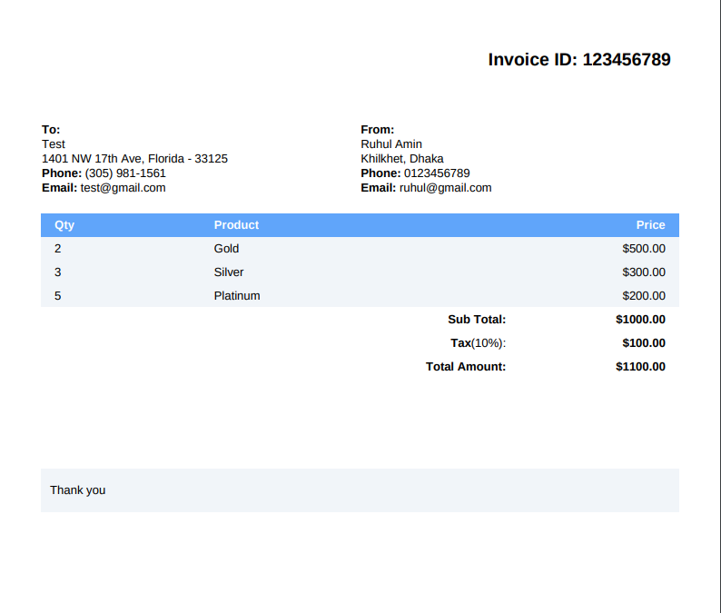

# Generate-Invoice-PDF
I will show you laravel invoice pdf template. We will use laravel generate invoice pdf. you can understand a concept of how to generate invoice pdf in laravel using dompdf. 



```bash
git clone https://github.com/ruhulamin63/Generate-Invoice-PDF.git
```

```bash
cp .env.example .env
```

```bash
DB_CONNECTION=mysql
DB_HOST=127.0.0.1
DB_PORT=3306
DB_DATABASE=your-db-name
DB_USERNAME=root
DB_PASSWORD=
```

```bash
composer update
```

```bash
php artisan migrate
```

### Public Access Route
```bash
localhost:8000/invoice-pdf
```